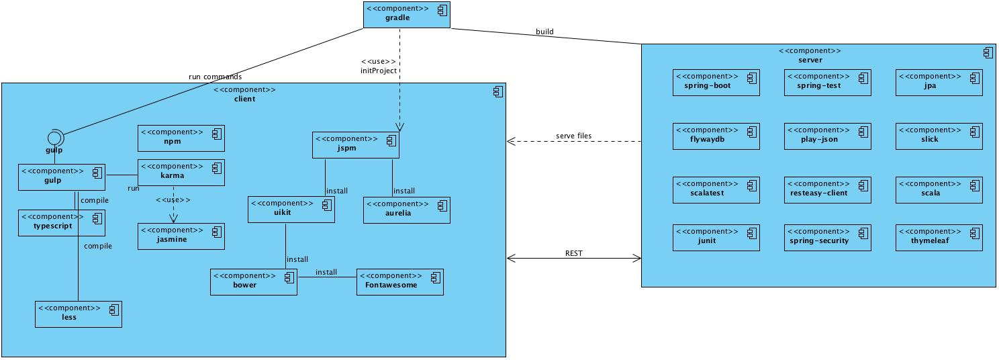

This a top down view of this project

The clue of the build process is *gradle* component, it delegates to gulp on the client.

The server serves static files from the client project, and communicates mainly through REST API

## Client

The client is a Single Page Web Application ruled by **Aurelia** component

**NPM** for utilities goodies

**JSPM** and bower install javascript libraries. This project use JSPM for all,
and bower for a few. JSPM is javascript modules oriented with steroids.

Automate testes run on real browsers with **karma**.

**Typescript** is the favorite language

## Server

**Spring** and **Spring Boot** rules

**Flywaydb** is used for migrations in database

The standard test engine is **Scalatest** but some need to run with JUnit
because of spring test integration issues.

You can write Integrations tests in scalatest, but you don't have some services

* **PlayJson** is good to write custom JSON to respond a request
* **Resteasy-client** is good to call third part rest services. SpringTemplate do not
play well when integrated with [Keycloak](http://keycloak.jboss.org) auth server
* **JPA** for easy database access
* **Slick** for performance database access and more Query oriented functional consults.
